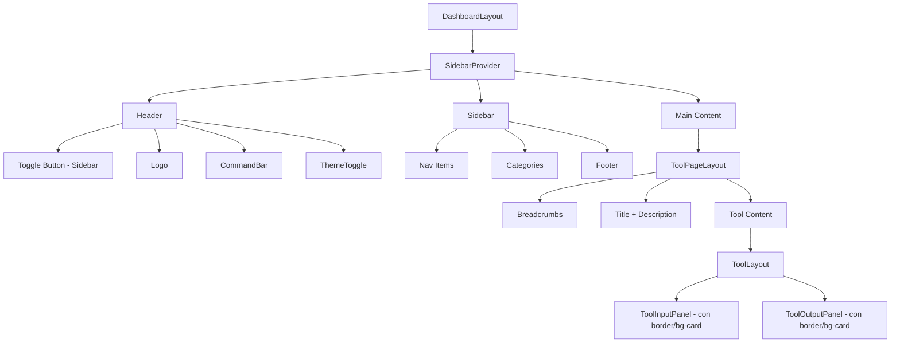
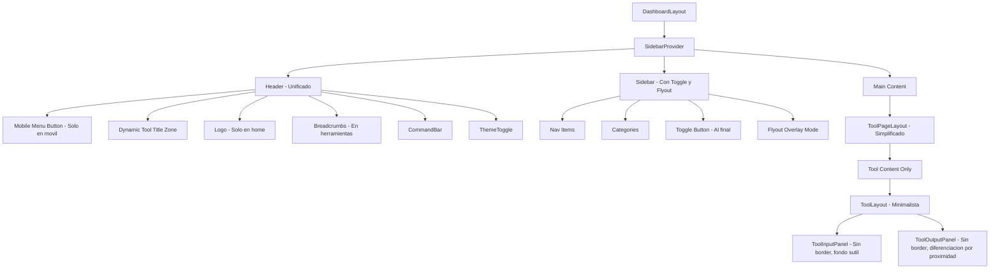
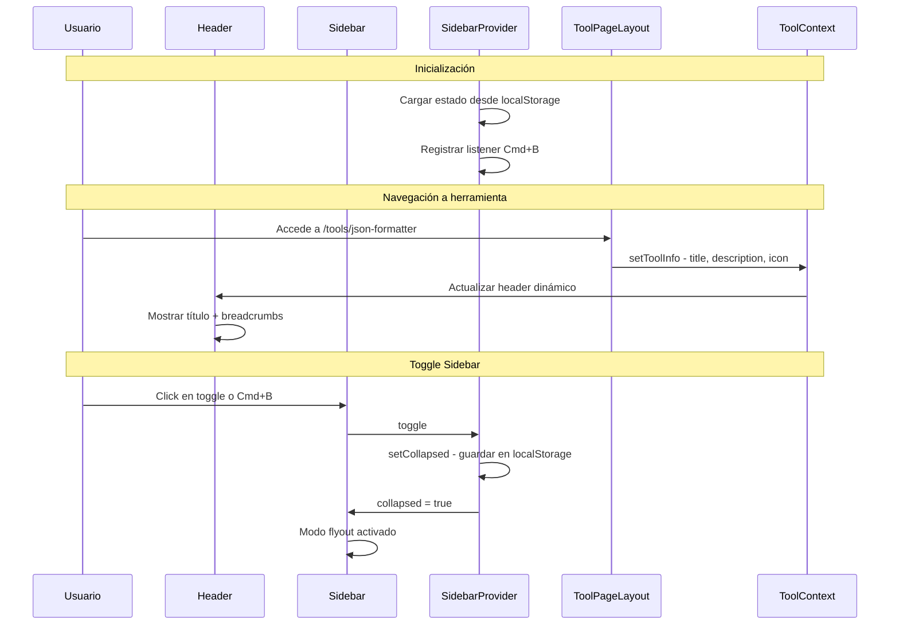

# Plan de Refactorización: Tools Hub UI/UX

## Resumen Ejecutivo

Este plan detalla la refactorización de la estructura principal de la aplicación Tools Hub para lograr un diseño más limpio, espacioso y funcional, siguiendo principios de minimalismo UX/UI.

---

## Análisis del Estado Actual

### Estructura de Componentes Actual



### Problemas Identificados

1. **Desperdicio de espacio vertical**: `ToolPageLayout` duplica información que podría estar en el Header
2. **Cajas rígidas**: `ToolInputPanel` y `ToolOutputPanel` usan `border` y `bg-card` creando una sensación pesada
3. **Toggle mal ubicado**: El botón de colapsar sidebar está en el Header, no en el Sidebar
4. **Sin persistencia**: El estado del sidebar se pierde al recargar
5. **Sin flyout**: El sidebar colapsado no tiene comportamiento hover/click para expandirse temporalmente

---

## Arquitectura Propuesta

### Nueva Estructura de Componentes



---

## Detalle de Cambios por Archivo

### 1. SidebarProvider.tsx

**Cambios requeridos:**

- Añadir persistencia con `localStorage`
- Implementar listener de teclado para `Cmd/Ctrl + B`
- Exponer función `setCollapsed` para control externo

**Implementación propuesta:**

```typescript
// Nuevo estado con persistencia
const [collapsed, setCollapsed] = useState<boolean>(() => {
  if (typeof window !== 'undefined') {
    const saved = localStorage.getItem('sidebar-collapsed');
    return saved === 'true';
  }
  return false;
});

// Efecto para guardar cambios
useEffect(() => {
  localStorage.setItem('sidebar-collapsed', String(collapsed));
}, [collapsed]);

// Efecto para atajo de teclado
useEffect(() => {
  const handleKeyDown = (e: KeyboardEvent) => {
    if ((e.metaKey || e.ctrlKey) && e.key === 'b') {
      e.preventDefault();
      setCollapsed(prev => !prev);
    }
  };
  window.addEventListener('keydown', handleKeyDown);
  return () => window.removeEventListener('keydown', handleKeyDown);
}, []);
```

---

### 2. Sidebar.tsx

**Cambios requeridos:**

1. **Mover toggle a la parte inferior**
2. **Implementar modo Flyout** cuando está colapsado
3. **Añadir soporte para Drawer en móvil**

**Estructura propuesta:**

```tsx
// Wrapper con comportamiento flyout
<aside 
  className={cn(
    "hidden md:flex flex-col border-r bg-muted/30 transition-all duration-300",
    collapsed 
      ? "w-16 hover:w-64 absolute z-40 bg-background shadow-lg" 
      : "w-64 relative"
  )}
  onMouseEnter={() => collapsed && setFlyoutOpen(true)}
  onMouseLeave={() => collapsed && setFlyoutOpen(false)}
>
  {/* Nav content */}
  
  {/* Toggle Button al final */}
  <div className="mt-auto border-t p-2">
    <button onClick={toggle}>
      {collapsed ? <PanelLeftOpen /> : <PanelLeftClose />}
    </button>
    {!collapsed && (
      <kbd className="text-xs text-muted-foreground">⌘B</kbd>
    )}
  </div>
</aside>
```

**Comportamiento Flyout:**

- Cuando `collapsed === true`: El sidebar muestra solo iconos (w-16)
- En `mouseenter`: Se expande a w-64 como overlay (absolute + z-40)
- En `mouseleave`: Vuelve a w-16
- El contenido principal NO se mueve (no layout shift)

---

### 3. Header.tsx

**Cambios requeridos:**

1. **Eliminar botón toggle de sidebar** (se mueve al Sidebar)
2. **Añadir menú hamburguesa para móvil** (Drawer/Sheet)
3. **Crear zona dinámica para título de herramienta**
4. **Fusionar visualmente con ToolPageLayout**

**Estructura propuesta:**

```tsx
<header>
  <div className="flex items-center gap-4">
    {/* Mobile Menu - Solo visible en móvil */}
    <Sheet open={mobileOpen} onOpenChange={setMobileOpen}>
      <SheetTrigger asChild className="md:hidden">
        <Button variant="ghost" size="icon">
          <Menu />
        </Button>
      </SheetTrigger>
      <SheetContent side="left" className="p-0 w-64">
        <Sidebar categories={categories} />
      </SheetContent>
    </Sheet>
    
    {/* Dynamic Zone - Cambia según contexto */}
    {toolInfo ? (
      <div className="flex items-center gap-3">
        <Breadcrumbs items={toolInfo.breadcrumbs} />
        <div>
          <h1>{toolInfo.title}</h1>
          <p>{toolInfo.description}</p>
        </div>
      </div>
    ) : (
      <Logo />
    )}
    
    {/* CommandBar + Actions */}
    <CommandBar />
    <ThemeToggle />
  </div>
</header>
```

---

### 4. ToolLayout.tsx

**Cambios requeridos:**

1. **Eliminar `border` y `bg-card` de paneles**
2. **Usar fondos sutiles solo para diferenciación**
3. **Aumentar espaciado y agrupación por proximidad**

**Antes:**

```tsx
<div className="rounded-xl border bg-card overflow-hidden">
```

**Después:**

```tsx
<div className="space-y-4">
  {/* Sin border, sin bg-card fuerte */}
  {/* Fondo muy sutil solo en inputs */}
</div>
```

**Nuevos estilos propuestos:**

| Componente | Antes | Después |
|------------|-------|---------|
| `ToolSection` | `border bg-card p-5` | `p-4` o `space-y-4` |
| `ToolInputPanel` | `border bg-card` | `bg-muted/20 rounded-lg` |
| `ToolOutputPanel` | `border bg-card` | Sin fondo, separación por `divide-y` |

---

### 5. ToolPageLayout.tsx

**Cambios requeridos:**

1. **Eliminar header duplicado** (título, descripción, breadcrumbs)
2. **Exponer información de herramienta al Header global**
3. **Solo renderizar el contenido de la herramienta**

**Propuesta: Crear contexto para herramienta activa**

```tsx
// Nuevo: ToolContext
interface ToolContextValue {
  title: string;
  description?: string;
  category?: ToolCategory;
  icon?: LucideIcon;
  breadcrumbs?: BreadcrumbItem[];
}

// ToolPageLayout simplificado
export function ToolPageLayout({ title, description, children, ... }: Props) {
  // Registrar herramienta en contexto
  useSetActiveTool({ title, description, ... });
  
  return (
    <div className="space-y-4">
      {children}
    </div>
  );
}
```

---

## Flujo de Datos Propuesto



---

## Consideraciones de Accesibilidad

1. **Navegación por teclado:**
   - `Cmd/Ctrl + B` para toggle sidebar
   - `Escape` para cerrar drawer móvil
   - `Tab` navegación correcta en modo flyout

2. **ARIA labels:**
   - `aria-expanded` en sidebar
   - `aria-label` en botón toggle
   - `role="navigation"` en sidebar

3. **Focus management:**
   - Al abrir drawer móvil, focus trap dentro
   - Al cerrar flyout, mantener focus en último elemento activo

---

## Consideraciones Responsive

| Breakpoint | Comportamiento |
|------------|----------------|
| Mobile (<768px) | Sidebar oculto, Drawer con Sheet, Hamburguesa visible |
| Tablet (768px-1024px) | Sidebar colapsado por defecto, flyout en hover |
| Desktop (>1024px) | Sidebar expandido, toggle manual disponible |

---

## Orden de Implementación Recomendado

1. **SidebarProvider.tsx** - Base para persistencia y atajos
2. **Sidebar.tsx** - Toggle y flyout
3. **Header.tsx** - Zona dinámica y drawer móvil
4. **ToolContext** - Nuevo contexto para herramienta activa
5. **ToolPageLayout.tsx** - Simplificación
6. **ToolLayout.tsx** - Minimalismo visual

---

## Archivos a Crear

- `tools-hub/core/providers/ToolProvider.tsx` - Contexto para herramienta activa
- `tools-hub/components/ui/sheet.tsx` - **REQUERIDO** - Componente para drawer móvil (no existe actualmente)

---

## Checklist de Validación

- [ ] Sidebar persiste estado entre recargas
- [ ] Cmd/Ctrl+B alterna sidebar
- [ ] Flyout funciona sin layout shift
- [ ] Drawer móvil funciona correctamente
- [ ] Header muestra título dinámico de herramienta
- [ ] Breadcrumbs visibles en Header
- [ ] ToolLayout sin cajas rígidas
- [ ] Espaciado adecuado entre secciones
- [ ] Accesibilidad por teclado completa
- [ ] Responsive en todos los breakpoints
